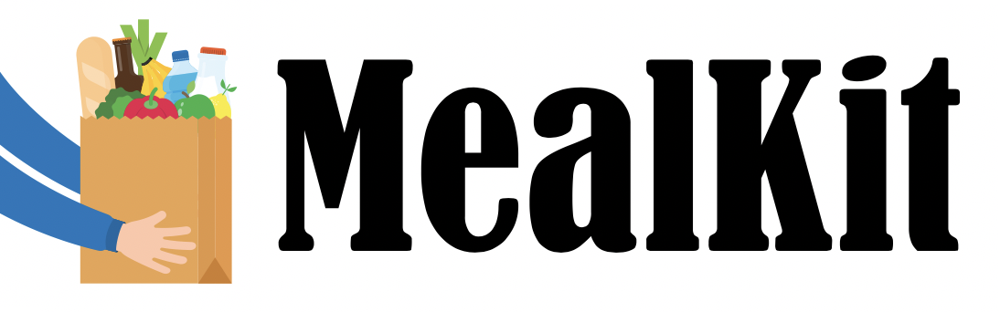

# MealKit-BE

`MealKit` is a fully functional food with recipe delivery cart built the following coding language: React.js(Frondend), Node.js(Backend), Postgre(Database).

## Installation

1. Create a folder to hold your installation: `mkdir MealKit-BE`
2. FTP/Copy the contents of the zip to your newly created folder
3. Enter folder: `cd MealKit-BE`
4. Install dependencies: `npm install`
5. Start application: `node server.js`

## Database

`MealKit` uses Postgres for storing all the data. Once you set up the database connection. Then for your backend folder
 type : `knex imgration:latest` in your terminal for the database connection.

## Built With 

- Postgres: Database structure
- DBeaver: Database
- Node.js: Backend development